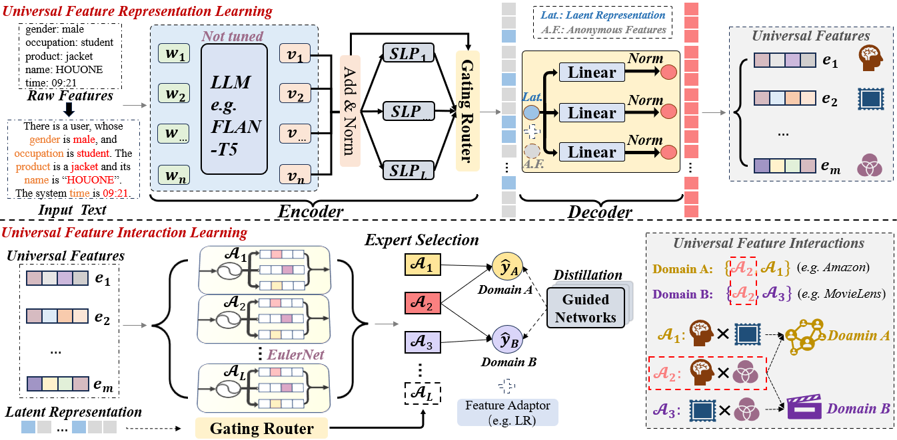

# UFIN

This is the official PyTorch implementation for the paper:

- [UFIN: Universal Feature Interaction Network for Multi-Domain Click-Through Rate Prediction]

## Overview

We propose the Universal Feature Interaction Network (UFIN) approach for CTR prediction.
UFIN exploits textual data to learn universal feature interactions that can be effectively transferred across diverse domains.
For learning universal feature representations, we regard the text and feature as two different modalities and  propose an encoder-decoder network founded on a Large Language Model (LLM)  to enforce the transfer of data from the text modality to the feature modality.
Building upon the above foundation, we further develop a mixture-of-experts (MoE) enhanced adaptive feature interaction model to learn transferable collaborative patterns across multiple domains.
Furthermore,  we propose a multi-domain knowledge distillation framework to enhance  feature interaction learning.
Based on the above methods, UFIN can effectively bridge the semantic gap to learn common knowledge across various domains, surpassing the constraints of ID-based models.
Extensive experiments conducted  on eight datasets show the effectiveness of UFIN, in both multi-domain and cross-platform settings.



## Requirements

```
tensorflow==2.4.1
python==3.7.3
cudatoolkit==11.3.1
pytorch==1.11.0
transformers
```

## Dataset Preparation
To evaluate the performance of our model, we conduct experiments on the [Amazon](https://nijianmo.github.io/amazon/index.html) and [MovieLens-1M](https://grouplens.org/datasets/movielens) datasets.
The scripts for dataset processing can be found under the **/DataSource** folder.
You first need to download the raw dataset files and put them into the **/DataSource** folder.

Then pre-process the data:
```
python DataSource/[dataset]_parse.py
```

Finally, get the files for training, validation, and testing:
```
bash split_all.sh
```

## Quick Start

### 1. Guided Networks Preparation
```
bash pretrain_teacher.sh
```

### 2. Training
```
python train.py --config_files=UFIN.yaml
```

### 3. Evaluation
```
bash test_all.sh
```

